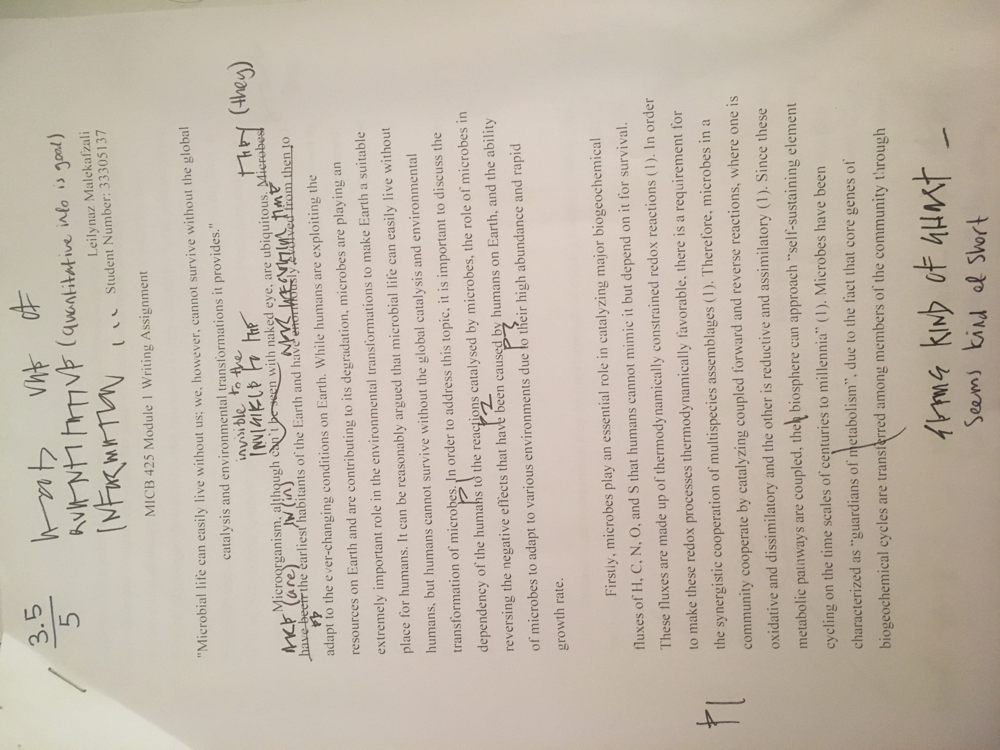
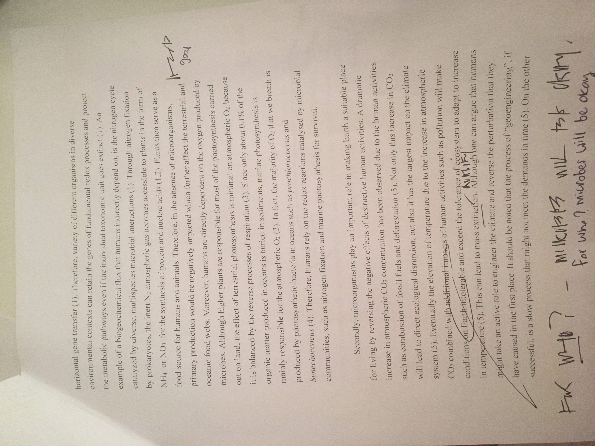
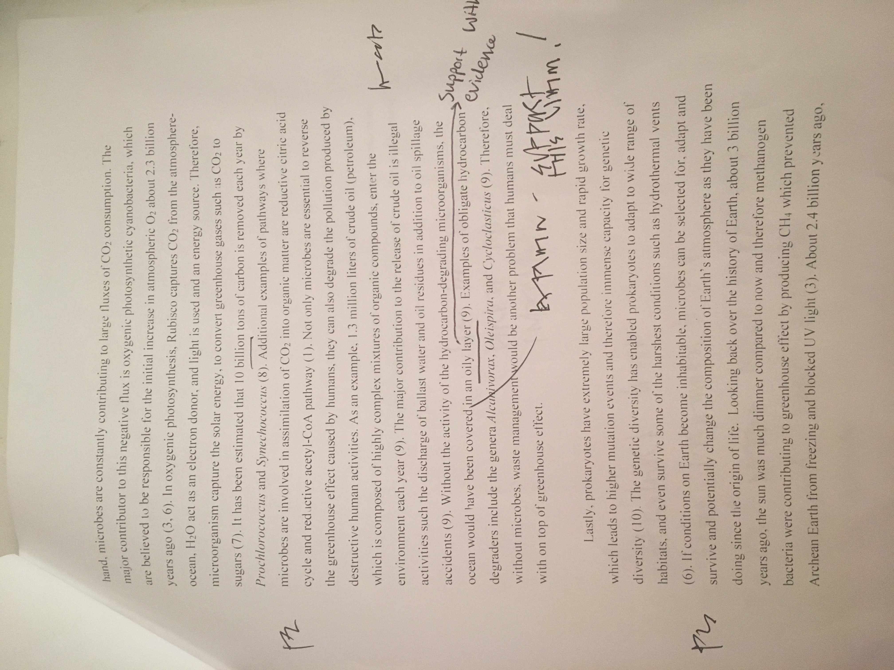
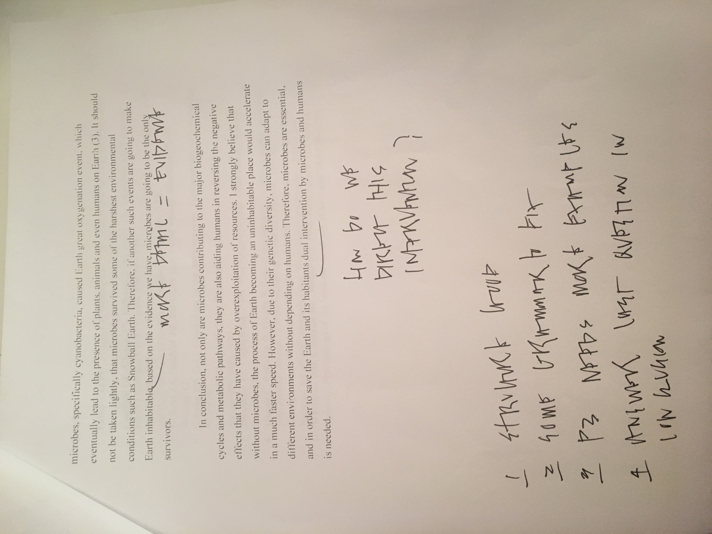
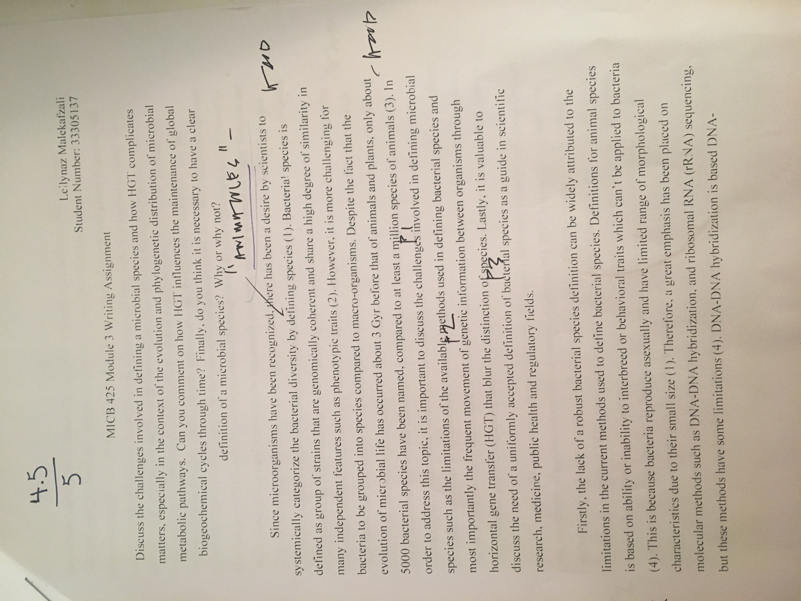
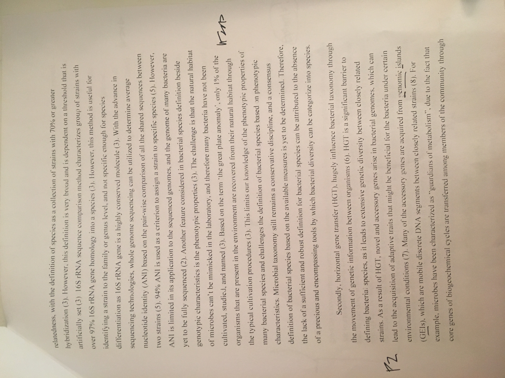
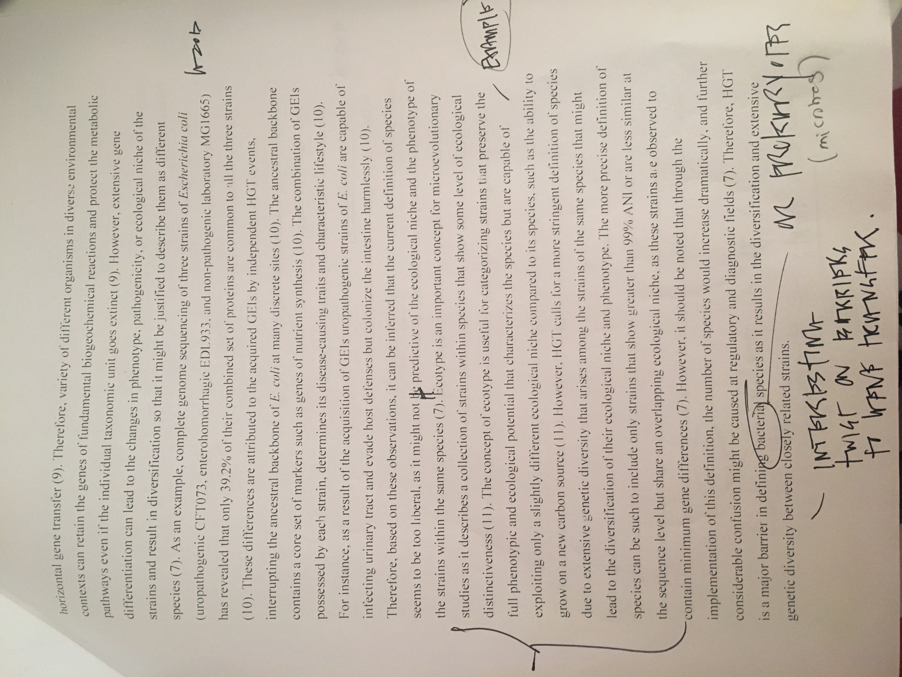
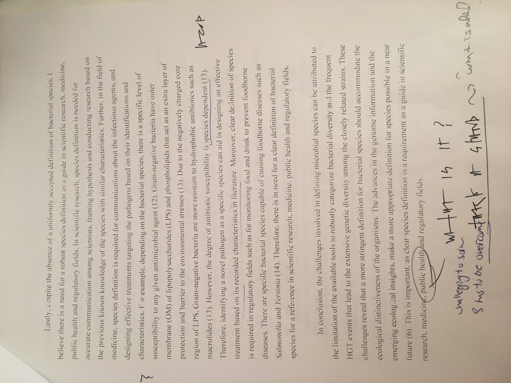
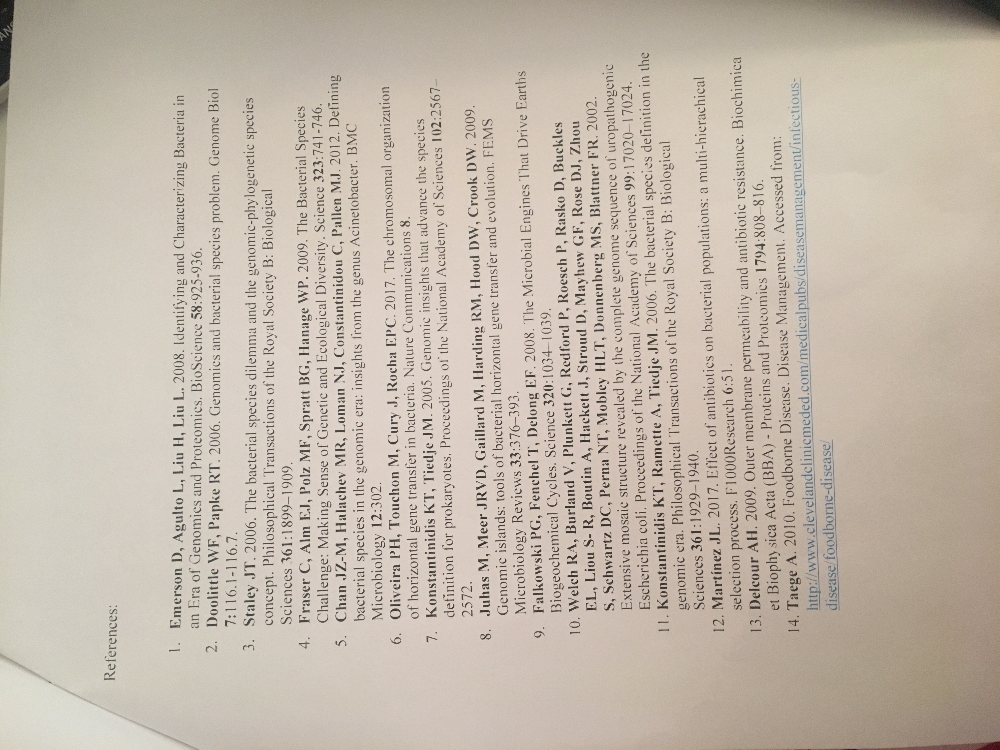

# R Markdown PDF Challenge

The following assignment is an exercise for the reproduction of this .html document using the RStudio and RMarkdown tools we’ve shown you in class. Hopefully by the end of this, you won’t feel at all the way this poor PhD student does. We’re here to help, and when it comes to R, the internet is a really valuable resource. This open-source program has all kinds of tutorials online.


## Challenge Goals 

The goal of this R Markdown html challenge is to give you an opportunity to play with a bunch of different RMarkdown formatting. Consider it a chance to flex your RMarkdown muscles. Your goal is to write your own RMarkdown that rebuilds this html document as close to the original as possible. So, yes, this means you get to copy my irreverant tone exactly in your own Markdowns. It’s a little window into my psyche. Enjoy =)

**hint: go to the [PhD Comics website](http://phdcomics.com/) to see if you can find the image above**  
*If you can’t find that exact image, just find a comparable image from the PhD Comics website and include it in your markdown*

### Here's a header!

Let’s be honest, this header is a little arbitrary. But show me that you can reproduce headers with different levels please. This is a level 3 header, for your reference (you can most easily tell this from the table of contents).

#### Another header, now with maths

Perhaps you’re already really confused by the whole markdown thing. Maybe you’re so confused that you’ve forgotton how to add. Never fear! ~~A calculator~~ R is here:

```{r}
1231521+12341556280987
```


### Table Time 

Or maybe, after you’ve added those numbers, you feel like it’s about time for a table!  
I’m going to leave all the guts of the coding here so you can see how libraries (R packages) are loaded into R (more on that later). It’s not terribly pretty, but it hints at how R works and how you will use it in the future. The summary function used below is a nice data exploration function that you may use in the ^future^.

```{r}
library(knitr)
kable(summary(cars),caption="I made this table with kable in the knitr package library")
```


And now you’ve almost finished your first RMarkdown! Feeling excited? We are! In fact, we’re so excited that maybe we need a big finale eh? Here’s ours! Include a fun gif of your choice!


---
title: "Evidence_worksheet_01"
author: "Leilynaz Malekafzali"
student number: "33305137"
date: "Feb 19th, 2018"
output:
  html_document: default
  word_document: default
---

```{r setup, include=FALSE}
knitr::opts_chunk$set(echo = TRUE)
```

# Module 1: 

## Evidence Worksheet for "Prokaryotes: The Unseen Majority"

[Whitman et al 1998](https://www.ncbi.nlm.nih.gov/pmc/articles/PMC33863/)

### Learning Objectives
Describe the numerical abundance of microbial life in relation to ecology and biogeochemistry of Earth systems.


### General Questions
#### What were the main questions being asked?

What is the number of prokaryotic cells in different environments on Earth? Which areas are the prokaryotes the most abundant? What is the amount of prokaryotic cellular carbon in different habitats? How much of the total Earth carbon content is contributed by the prokaryotic cellular carbon? What is the turn over rate of the prokaryotic population and how does it contribute to the mutation rate and therefore diversity in prokaryotes? 


#### What were the primary methodological approaches used?

The primary methodological approaches are estimations which is to take small samples to represent the habitat. Additionally, they use the cell density, volume, and cellular carbon of prokaryotes to calculate total number of cells in a habitat.
Specific calculation of each habitat methodological approaches: 
For aquatic environment (polar region)- they estimated number of prokaryotes based on the mean cell numbers reported in previous literature Delille and Rosiers, and the mean areal extent of seasonal ice. 
For soil- they estimated the number of prokaryotes based on detained direct counts from a coniferous forest ultisol. They used this estimate and applied it to all the forest soils.
For subsurface- they used few direct enumerationd of subsurface prokaryotes. For deeper sediments, they extrapolated the number of prokaryoted based on a formula. Another approach that they used is based on the porosity of the terrestrial subsurface, and total pore space occupied by prokaryotes. Also they used the number of unattached prokaryoted calculated from groundwater data from previous studies. 
To calculate Carbon content- They used the prokaryotic cell numbers, and then they assumed that the amount of the cellular carbon is half of the dry weight. They also assumed the amount of carbon production should be 4 times the the carbon content based on the efficiency of carbon assimilation. They used this information to make an assumption about the turn over rate of prokaryotes. 

#### Summarize the main results or findings. 

Most of the prokaryotes reside in open ocean (1.2 x 10^29), soil (1.2 x 10^29), oceanic (3.5 x 10^30) and terrestrial subsurfaces (0.25-2.5 x 10^30). The number of prokaryotes on Earth is estimated to be 4-6 x 10^30 cells. The amount of prokaryotic cellular carbon on Earth is estimated to be 350-550 Pg. Including prokaryotic carbon in global models will nearly double the amount of carbon stored in living organisms.Prokaryotes contain 85-130 Pg of N and 9-14 Pg of P, which is about 10-fold more nutrients than found in plants.The average turn over times of prokaryotes is 6-25 days in the upper 200 m of the open ocean, 0.8 yr in the ocean below 200 m, 2.5 yr in soil, and 1-2 x 10^3 yr in subsurface. The cellular production rate for prokaryotes is estimated to be 1.7 x 10^30 cells/year.Prokaryotes exist in plants, air, and leafs but the number is much lower compared to the large resivors. Due to the abundance of prokaryotes and high turn over rates, there is an enormous genetic diversity among prokaryotes.


#### Do new questions arise from the results?

How do we define prokaryotes? what is the composition of microbes in each compartment? What are the measures that have to be taken into account in the phylogenic analyses to distinguish prokaryotes from eukaroytes? Is there any better measuring techniques in place that can lower the assumptions and error? How reliable are the numbers that are mentioned in this article? How does the turn over rate of the prokaryotes affect the nutrient cycles and impact other organisms? 


#### Were there any specific challenges or advantages in understanding the paper (e.g. did the authors provide sufficient background information to understand experimental logic, were methods explained adequately, were any specific assumptions made, were conclusions justified based on the evidence, were the figures or tables useful and easy to understand)? 

The authors didn’t explain the calculations well and mostly provided us with the final numbers.It would be beneficial to have a supplementary attached which was going in to details of errors and how reliable are the numbers reported in the article.The authors didn't state their assumptions clearly. Additionally, the authors used a lot of data and methods from previous literatures but they didn't explain much about them

---
title: "Evidence_worksheet_02"
author: "Leilynaz Malekafzali (33305137)"
date: "version `r format(Sys.time(), '%B %d, %Y')`"
output: html_document
---
## Evidence Worksheet_02 “Life and the Evolution of Earth’s Atmosphere”

[Kasting & Siefert 2003](http://science.sciencemag.org/content/296/5570/1066/tab-article-info)

### Learning objectives: 
Comment on the emergence of microbial life and the evolution of Earth systems
    
### General Questions 

* Indicate the key events in the evolution of Earth systems at each approximate moment in the time series. If times need to be adjusted or added to the timeline to fully account for the development of Earth systems, please do so. 

    + 4.6 billion years ago : Inner planets received carbon and water vapour. star system  developed due to super nova explotions. Moon formed and spin and tilt of Earth evolved leading to present day and night cycles and seasons. 
    
    + 4.5-4.1 billion years ago: Due to early sun being weak, high levels of CO2 increased the temperature.
    
    + 4.2 billion years ago : Evidence of life (Isotopes of C preserved in grafite). Oldest Rock (Coherent assamblages of mineral).
    
    + 3.8 billion years ago : Oldest sedimentary rocks and methanogenesis- oceans and weathering- maybe the oldest known sediments. 
    
    + 3.5 billion years ago : Photosynthesis by Cyanobacteria and microfossils and stromatolites present. Stromatolites are organosedimentary structures produced by microbial trapping.
    
    + 2.7 billion years ago : Great oxidation event: responsible for glaciation. Here the planet would have been brown because of the methanogens to keep the planet warm because the sun was less illuminant. 
    
    + 2.2 billion years ago : Increase in biological production. 
    
    + 1.7 billion years ago : Appearance of eukaryotes in the form of algea.
    
    + 1.1 billion years ago : Snowball Earth
    
    + 550,000 years ago : Cambrian explosion where larger animals appear. Land plants also observed which once again increase the oxygen concentration in atmosphere.
    
    + 200,000 years ago : Gigantic organims appear. Permian extinction when 95% of species extinct.


* Describe the dominant physical and chemical characteristics of Earth systems at the following waypoints:  

    + Hadean : During this time, there was a high concentration of CO2 to keep the Earth warm as the sun was 30% less illuminant. Earth was also very hot. Spin and tilt of the Earth evolved due to the formation of moon. Star system formed due to super nova explosion. 
    
    + Archean : High concentration of methane produced by methanogens to keep th Earth warm. Some O2 was present in the atmosphere due to the photosynthesis of Cyanobacteria.  
    
    + Proterozoic : CO2 produced as a result of the raction between oxygen and methane. This was responsible for making the Earth cold due to the decrease in the green house effect which lead to glaciation.  
    
    + Phanerozoic : Increase in atmospheric oxygen concentration due to increase in land plants. Formation of coal deposits die to the death of the organims. 
    
---
title: "Evidence_worksheet_03"
author: "Leilynaz Malekafzali (33305137)"
date: "version `r format(Sys.time(), '%B %d, %Y')`"
output: html_document
---
## Evidence Worksheet_ 03 "The Anthropocene "

[Rockstrom et al 2009](https://www.nature.com/articles/461472a)

### Learning Objectives

Evaluate human impacts on the ecology and biogeochemistry of Earth systems.

### Specific questions

#### What were the main questions being asked?

How humans can operate safely and prevent their activities to cause environmental changes? What is the threshold within which humans should operate? How can boundaries for various processes be combined and connected? How have humans impacted Earth?

####What were the primary methodological approaches used?

The author develops his arguments through citing multiple authors and books in the paper. Using Planetary boundaries. For defining these boundaries, the author cite various literatures on the fossil records about the extinction rates and atmospheric carbon dioxide levels. 

#### Summarize the main results or findings.

Unacceptable environmental changes can be generated if the threshold is crossed for the processes. 9 processes were discussed that need planetary boundaries: change in land use, atmospheric aerosol loading, ocean acidification, global fresh water use, stratospheric ozone depletion, rate of biodiversity loss, climate change, and interference with nitrogen and phosphorus cycles. 
Some of the boundaries for these processes have been passed such as for climate change. Additionally, the boundaries for some other processes are soon to be approached such as global freshwater use.
If these thresholds are not crossed by humans, they can purse long-term social and economic developments.
Changes in the atmospheric carbon dioxide should not exceed 350 parts per million by volume. 

#### Do new questions arise from the results?

Are the proposed models for setting boundaries reliable? Are the threshold discussed take into account the increasing rate of human activities on Earth? Does these threshold values vary from location to location on Earth?

#### Were there any specific challenges or advantages in understanding the paper (e.g. did the authors provide sufficient background information to understand experimental logic, were methods explained adequately, were any specific assumptions made, were conclusions justified based on the evidence, were the figures or tables useful and easy to understand)?

The authors provided enough background information to understand the paper. However, the authors didn't include any figures to describe their proposed models which would have helped the readers further to understand the author's rationals. Also, sometimes the authors claim facts without providing evidence. 


---
title: "Problem_set_01"
author: "Leilynaz Malekafzali"
student number: "33305137"
date: "Feb 19th, 2018"
output:
  html_document: default
  word_document: default
---

## Problem set_01 for "Prokaryotes: The Unseen Majority"


### Learning objective 
Describe the numerical abundance of microbial life in relation to the ecology and biogeochemistry of Earth systems. 

### Specific questions

#### What are the primary prokaryotic habitats on Earth and how do they vary with respect to their capacity to support life? Provide a breakdown of total cell abundance for each primary habitat from the tables provided in the text.

It has been indicated that most of the prokaryotes reside in three large habitats: seawater, soil and the sediment/soil subsurface. Aquatic- 1.181 x 10^29 cells. Soil- 2.556 x 10^29. Subsurface sediments- 3.8 x 10^30 (oceanic subsurface: 3.5 x 10^30 and terrestrial subsurface: 0.25-2.5 x 10^30).

#### What is the estimated prokaryotic cell abundance in the upper 200 m of the ocean and what fraction of this biomass is represented by marine cyanobacterium including Prochlorococcus? What is the significance of this ratio with respect to carbon cycling in the ocean and the atmospheric composition of the Earth?

The estimated prokaryotic cell abundance is 3.6 x 10^28 in the upper 200 m at cellular density of 5 x 10^5 cells/ml. The average cellular density of the autotrophic marine. cyanobacteria and *prochlorococcus spp.* in the upper 200 m is 4 x 10^4 cells/ml. The fraction is : (4x 10^4)/ (5x 10^5) = 8%. This means that 8% of the  autotrophic prokaryotes in charge of carbon cycle in the ocean to provide organic carbon for the majority of the hetrotrophic prokaryotes. 

#### What is the difference between an autotroph, heterotroph, and a lithotroph based on information provided in the text?

Autotrophs is "self- nourishing", fix inorganic carbon (CO2) into biomass using light source as energy. Heterotroph: assimilate organic carbon- Uses organic substrates for both Carbon and energy source. Litotroph: use inorganic substrates for C source and energy source.

#### Based on information provided in the text and your knowledge of geography what is the deepest habitat capable of supporting prokaryotic life? What is the primary limiting factor at this depth?

Subsurface: Teressterial and marine: ~4 Km deep in the subsurface there is life. Deepest point in the ocean is Mariana's Trench: 10.9 km down. Therefore 4 km lower than Mariana's Trech is 14.9 km deep down that life could exist.Temperature is the limiting factor- it is about 125 C. Change in temperature is 22 C/km. 

#### Based on information provided in the text your knowledge of geography what is the highest habitat capable of supporting prokaryotic life? What is the primary limiting factor at this height?

Mount Everst is the highest point which is about 8.8 km above the sea level. Also microbes have been found to be transported up to 77 km. However the limiting factor is the ionizing radiation and lack of nutrients and moisture. Therefore the microbes might not be metabolizing and maybe spores. 

#### Based on estimates of prokaryotic habitat limitation, what is the vertical distance of the Earth’s biosphere measured in km?

From the top of mount Everest (8.8 km up) to the bottom of Mariana's Trench (10.9 km down) and 4 km deeper in to the sediment is 24 km.

#### How was annual cellular production of prokaryotes described in Table 7 column four determined? (Provide an example of the calculation)

Population x turn overtime /year 
Ex. for marine habitats: (3.6 x 10^28 cells x 365 days/ 16 turnover = 8.2 x 10^29 cells/ yr)

#### What is the relationship between carbon content, carbon assimilation efficiency and turnover rates in the upper 200m of the ocean? Why does this vary with depth in the ocean and between terrestrial and marine habitats?

Carbon efficiency- assumed to be 20%- only this percent is being assimilated. 
About 5-20 fg on average C in prokaryotic cells (used 20 fg for calculations): About 20 x 10^-30 pg/ cell.

3.6 x 10^ 28 cells x 20 x10^-30 pg/ cell = 0.72 pg carbon in marine heterotrophs.

They used multiplier of 4 instead of 5 for 20%-> 4 x 0,72= 2.88 pg/ yr. 

51 pg/ yr (carbon in photic zone) x 85% consumed = 43 pg C 

43 pg C/ yr / 2.88 pg /yr = 14.9 or 1 turnover every 24.5 days. Half of the carbon of the planet is among the prokaryotes. This number vary with depth in ocean and between terrestrial and marine habitats due to the change in microbial population.

#### How were the frequency numbers for four simultaneous mutations in shared genes determined for marine heterotrophs and marine autotrophs given an average mutation rate of 4 x 10-7 per DNA replication? (Provide an example of the calculation with units. Hint: cell and generation cancel out)

For heterotrophes: 
(4 x 10^-7 mutations/ generations) ^4 = 2.56 x 10^-26 mutation/ generation 

365 days/ 16=22.8 turnover/ year

3.6 x 10^28 cells in marine x 22.8 turn over/year= 8.2 x 10^29 cells/ year. 

2.56 x 10^-26 mutation/generation x 8.2 x 10^29 cells/ year x 1 year/ 12 months x 1 month/ 28 days x 1 day/ 24 hours = 2.603 mutation/ hr 

Frequency: 1/ 2.603 = 0.4  

For autothrophes: (4 x 10^-7)^4 x 7.1 x 10^29 turn over/ year x 1 year/ 8064 hr= 2.553 mutation/ hr. 

Frequency: 1/ 2.553~ 0.5

#### Given the large population size and high mutation rate of prokaryotic cells, what are the implications with respect to genetic diversity and adaptive potential? Are point mutations the only way in which microbial genomes diversify and adapt?

Mutations in prokaryotic cells are the major source of diversity and one of the essential factors in the formation of novel species. Additionally, due to mutations, prokaryotes can be selected for and adapt to variety of environments. Point mutations are not the only way in which microbial genomes diversify and adapt. Horizontal gene transfer (HGT), insertions, deletions, and vertical gene transfer are other ways that microbial genome can diversity and adapt.

#### What relationships can be inferred between prokaryotic abundance, diversity, and metabolic potential based on the information provided in the text?

Large population size and rapid replication of prokaryotes implies that extremely rare events can occur frequently.  High mutation leads to increase in diversity and therefore increase in metabolic potential in response to stress and selective pressure.

---
title: "Problem_set_02"
author: "Leilynaz Malekafzali"
student number: "33305137"
date: "Feb 19th, 2018"
output:
  html_document: default
  word_document: default
---

## Problem set_02 “Microbial Engines”
### Learning objectives: 
Discuss the role of microbial diversity and formation of coupled metabolism in driving global biogeochemical cycles.

### Specific Questions:

#### What are the primary geophysical and biogeochemical processes that create and sustain conditions for life on Earth? How do abiotic versus biotic processes vary with respect to matter and energy transformation and how are they interconnected?  

Geophysical: Tectonics and atmospheric photochemical processes-> supply substrates and remove products. They allow elements and molecules to interact with each other, and chemical bonds to form and break in cyclical manner.

Biogeochemical:  The biological fluxes of 6 major elements- H,C,N,O,S, and P that constitute major building blocks for all biological macromolecules. Geochemical reactions are based on acid/ base chemistry. The biogeochemical fluxes are driven largely by microbes that catalyze thermodynamically constrained reactions. Additionally, volcanism and rock weathering play a role in resupply of C, S, and P. 

Abiotic reactions: are based on acid/base chemistry (transfer of protons without electrons).

Biotic reactions: redox reaction that is dependant on the successive transfers of electrons and protons from a relatively limited set of chemical elements.

The way that the biotic and abotic processes are interconnected is that biogeochemical cycles have evolved on a planetary scale to form a set of nested abiotiotically driven acid/base reactions and biologically driven redox reactions that set lower limits on external energy that are required to sustain these cycles.

#### Why is Earth’s redox state considered an emergent property?

This is because feedbacks between the evolution of microbial metabolic and geochemical processes create the average redox condition of the oceans and atmosphere. Therefore, Earth's redox state is an emergent property of microbial life on a planetary scale. 

#### How do reversible electron transfer reactions give rise to element and nutrient cycles at different ecological scales? What strategies do microbes use to overcome thermodynamic barriers to reversible electron flow?  

Microbes carry genes that encode the multimerci protein complexes (machinery) responsible for redox chemistry (transfers of electron and protons) half-cells that form the basis of the major energy transducting pathways. In order to overcome thermodynamic barriers to reversible electron flow, microbes use identical or near-identical pathways for forward and reverse reactions to maintain cycles. That in one direction the process is oxidative, dissimilatory and energy producing, and in the other direction it is reductive, assimilatory and energy consuming. This process requires the synergistic cooperation of multispecies assemblages, a phenomenon that is typical for most biogeochemical transformations.

#### Using information provided in the text, describe how the nitrogen cycle partitions between different redox “niches” and microbial groups. Is there a relationship between the nitrogen cycle and climate change?   

For N2 to become accessible and be used in the synthesis of nucleic acids and proteins, N2 should be changed to NH4+ via nitrogen fixation. However, the enzyme responsible for fixation is inhibited by Oxygen. In the presence of oxygen, NH4+ can be oxidized to nitrate in a two-stage pathway, initially requiring a specific group of Bacteria or archea that oxidize ammonia to NO2- (via hydroxyamine), which is subsequently oxidized to NO3- by a different suite of nitrifying bacteria. The small differences in redox potential in the redox reactions is used by nitrifiers to reduce CO2 to organic matter. Finally, in the absence of oxygen, a third set of opportunistic microbes uses NO2- and NO3- as electron acceptors in anaerobic oxidation of organic matter. This pathway will ultimately form N2.  

The major cuase of climate change is the green house effect due to increase in the concentration of green house gasses in the Earth's atmosphere such as CO2. The nitrogen cycle affects the climate change, as CO2 is reduced to organic matter by the oxidation of NH4+ to NO2 and NO2 to NO3. Therefore this reduces atmospherinc CO2. 

#### What is the relationship between microbial diversity and metabolic diversity and how does this relate to the discovery of new protein families from microbial community genomes?  

The more diverse that the microbial community is, the more diverse are the metabolic activities that are observed in the community. The number of new protein families found are increasing linearly with the number of new genome sequenced. Also the discovery rate for new proteins is linearly even when the known number of protein sequences is increased threefold. This indicates that the journey of cataloguing extant protein sequence space is relatively new due to the limitless evolutionary diversity in nature. 


#### On what basis do the authors consider microbes the guardians of metabolism?  

Environmental selection on the microbial phenotype leads to the evolution of the boutique genes that ultimately protect the metabolic pathway. Dispersal of the core planetary gene set whether by vertical or horizontal gene transfer, has allowed wide variety of organisms to become guardians of metabolism simultaneously. That is even the pathway in a specific operational taxonomic unit does not survive an environmental perturbation the unit will go extinct but the pathway has a strong chance of survival in other units. 

---
title: "Module 1 writing assignment"
author: "Leilynaz Malekafzali"
student number: "33305137"
date: "Feb 19th, 2018"
output:
  html_document: default
  word_document: default
---

## Writing Assignment 1

#### Microbial life can easily live without us; we, however, cannot survive without the global catalysis and environmental transformations it provides." Do you agree or disagree with this statement? Answer the question using specific reference to your reading, discussions and content from evidence worksheets and problem sets. 

Microorganism, although invisible to the naked eye, are ubiquitous. They are the earliest inhabitants of the Earth and have evolved over the time to adapt to the ever-changing conditions on Earth. While humans are exploiting the resources on Earth and are contributing to its degradation, microbes are playing an extremely important role in the environmental transformations to make Earth a suitable place for humans. It can be reasonably argued that microbial life can easily live without humans, but humans cannot survive without the global catalysis and environmental transformation of microbes. In order to address this topic, it is important to discuss the dependency of the humans to the reactions catalysed by microbes, the role of microbes in reversing the negative effects that have been caused by humans on Earth, and the ability of microbes to adapt to various environments due to their high abundance and rapid growth rate. 

Firstly, microbes play an essential role in catalyzing major biogeochemical fluxes of H, C, N, O, and S that humans cannot mimic it but depend on it for survival. These fluxes are made up of thermodynamically constrained redox reactions (1). In order to make these redox processes thermodynamically favorable, there is a requirement for the synergistic cooperation of multispecies assemblages (1). Therefore, microbes in a community cooperate by catalyzing coupled forward and reverse reactions, where one is oxidative and dissimilatory and the other is reductive and assimilatory (1). Since these metabolic pathways are coupled, the biosphere can approach self-sustaining element cycling (1). Microbes have been characterized as "guardians of metabolism", due to the fact that core genes of biogeochemical cycles are transferred among members of the community through horizontal gene transfer (1). Therefore, variety of different organisms in diverse environmental contexts can retain the genes of fundamental redox processes and protect the metabolic pathways even if the individual taxonomic unit goes extinct (1). An example of a biogeochemical flux that humans indirectly depend on, is the nitrogen cycle catalyzed by diverse, multispecies microbial interactions (1). Through nitrogen fixation by prokaryotes, the inert N2 atmospheric gas becomes accessible to plants in the form of NH4+ or NO3- for the synthesis of protein and nucleic acids (1,2). Plants then serve as a food source for humans and animals. Therefore, in the absence of microorganisms, primary production would be negatively impacted which further affect the terrestrial and oceanic food webs. Moreover, humans are directly dependent on the oxygen produced by microbes. Although higher plants are responsible for most of the photosynthesis carried out on land, the effect of terrestrial photosynthesis is minimal on atmospheric O2, because it is balanced by the reverse processes of respiration (3). Since only about 0.1% of the organic matter produced in oceans is buried in sediments, marine photosynthesis is mainly responsible for the atmospheric O2 (3). In fact, the majority of O2 that we breath is produced by photosynthetic bacteria in oceans such as *prochlorococcus* and *Synechoccocus* (4). Therefore, humans rely on the redox reactions catalysed by microbial communities, such as nitrogen fixation and marine photosynthesis for survival. 

Secondly, microorganisms play an important role in making Earth a suitable place for living by reversing the negative effects of destructive human activities. A dramatic increase in atmospheric CO2 concentration has been observed due to the human activities such as combustion of fossil fuels and deforestation (5). Not only this increase in CO2 will lead to direct ecological disruption, but also it has the largest impact on the climate system (5). Eventually the elevation of temperature due to the increase in atmospheric CO2 combined with additional impacts of human activities such as pollution will make conditions on Earth intolerable for humans and animals and exceed the tolerance of ecosystem to adapt to increase in temperature (5). Although one can argue that humans might take an active role to engineer the climate and reverse the perturbation that they have caused in the first place. It should be noted that the process of "geoengineering", if successful, is a slow process that might not meet the demands in time (5). On the other hand, microbes are constantly contributing to large fluxes of CO2 consumption. The major contributor to this negative flux is oxygenic photosynthetic cyanobacteria, which are believed to be responsible for the initial increase in atmospheric O2 about 2.3 billion years ago (3, 6). In oxygenic photosynthesis, Rubisco captures CO2 from the atmosphere-ocean, H2O act as an electron donor, and light is used and an energy source. Therefore, microorganism capture the solar energy, to convert greenhouse gases such as CO2 to sugars (7). It has been estimated that 10 billion tons of carbon is removed each year by *Prochlorococcus* and *Synechococcus* (8). Additional examples of pathways where microbes are involved in assimilation of CO2 into organic matter are reductive citric acid cycle and reductive acetyl-CoA pathway (1). Not only microbes are essential to reverse the greenhouse effect caused by humans, they can also degrade the pollution produced by destructive human activities. As an example, 1.3 million liters of crude oil (petroleum), which is composed of highly complex mixtures of organic compounds, enter the environment each year (9). The major contribution to the release of crude oil is illegal activities such the discharge of ballast water and oil residues in addition to oil spillage accidents (9). Examples of obligate hydrocarbon degraders include the genera *Alcanivorax*, *Oleispira*, and *Cycloclasticus* (9). These microorganisms play an important role in the degradation of oil in the ecosystem (9). Therefore, without microbes, waste management would be another problem that humans must deal with on top of greenhouse effect. 

Lastly, prokaryotes have extremely large population size and rapid growth rate, which leads to higher mutation events and therefore immense capacity for genetic diversity (10). The number of prokaryotic cells on Earth is estimated to be around 4-6 x 10^30 cells (10).The genetic diversity has enabled prokaryotes to adapt to wide range of habitats, and even survive some of the harshest conditions such as hydrothermal vents (6). If conditions on Earth become unsuitable for humans, microbes can be selected for, adapt and survive and potentially change the composition of Earth's atmosphere as they have been doing since the origin of life. Looking back over the history of Earth, about 3 billion years ago, the sun was much dimmer compared to now and therefore methanogen bacteria were contributing to greenhouse effect by producing CH4 which prevented Archean Earth from freezing and blocked UV light (3). About 2.4 billion years ago, microbes, specifically cyanobacteria, caused Earth great oxygenation event, which eventually lead to the presence of plants, animals and even humans on Earth (3). It should not be taken lightly, that microbes survived some of the harshest environmental conditions such as Snowball Earth, where the surface temperatures were bellow the freezing point and the planet was covered in deep sheet of ice (11). Therefore, if another such events are going to make Earth unsuitable for living, based on the evidence we have, microbes are going to be the only survivors.This is due to their rapid growth and turn over rates that allows for their significant genetic diversity. 

In conclusion, not only are microbes contributing to the major biogeochemical cycles and metabolic pathways, they are also aiding humans in reversing the negative effects that they have caused by overexploitation of resources. I strongly believe that without microbes, the process of Earth becoming an uninhabitable place would accelerate in a much faster speed. However, due to their genetic diversity, microbes can adapt to different environments without depending on humans. Therefore, microbes are essential, and in order to save the Earth and its inhabitants dual intervention by microbes and humans is needed. This can be achieved through bioengineering of microbial communities using synthetically derived models, which allow for the greater understanding of ecological and environmental processes (12). 


##### References 


1.	Falkowski PG, Fenchel T, Delong EF. 2008. The Microbial Engines That Drive Earths Biogeochemical Cycles. Science 320:1034-1039.(http://science.sciencemag.org/content/320/5879/1034.long)

2.	Canfield DE, Glazer AN, Falkowski PG. 2010. The Evolution and Future of Earth's Nitrogen Cycle. Science 330:192-196.(http://science.sciencemag.org/content/330/6001/192.long)

3.	Kasting JF, Siefert JL. 2002. Life and the Evolution of Earth's Atmosphere.Science 296:1066-1068.(http://science.sciencemag.org/content/296/5570/1066.long)

4.	Gilbert JA, Neufeld JD. 2014. Life in a World without Microbes. PLoS Biology 12.(http://journals.plos.org/plosbiology/article?id=10.1371/journal.pbio.1002020)

5.	Schrag DP. 2012. Geobiology of the Anthropocene. Fundamentals of Geobiology 425-436.(https://onlinelibrary.wiley.com/doi/10.1002/9781118280874.ch22)

6.	Nisbet EG, Sleep NH. 2001. The habitat and nature of early life. Nature 409:1083-1091.(https://www.nature.com/articles/35059210)

7.	Donohue TJ, Cogdell RJ. 2006. Microorganisms and clean energy. Nature Reviews Microbiology 4: 800.(https://www.nature.com/articles/nrmicro1534)

8.	Gupta C, Prakash D, Gupta S. Role of microbes in combating global warming. International Journal of Pharmaceutical Sciences Letters 4: 359-363.(https://www.researchgate.net/publication/264716464_Role_of_microbes_in_combating_global_warming)

9.	Brooijmans RJW, Pastink MI, Siezen RJ. 2009. Hydrocarbon-degrading bacteria: the oil-spill clean-up crew. Microbial Biotechnology 2:587-594.[PMC3815313](https://www.ncbi.nlm.nih.gov/pmc/articles/PMC3815313/)

10.	Whitman WB, Coleman DC, Wiebe WJ. 1998. Prokaryotes: The unseen majority. Proceedings of the National Academy of Sciences 95:6578-6583. [PMC33863](https://www.ncbi.nlm.nih.gov/pmc/articles/PMC33863/)

11.Hoffman, PF. 2016. Cryoconite Pans on Snowball Earth: Supraglacial Oases for Cryogenian Eukaryotes? Geobiology 14: 531–542. (http://advances.sciencemag.org/content/3/11/e1600983.full)

12. Franks AE, and Sivasubramaniam D. 2016. Bioengineering microbial communities: Their potential to help, hinder and disgust. Bioengineered 7: 137-144. [PMC4927200](https://www.ncbi.nlm.nih.gov/pmc/articles/PMC4927200/)

## Screen shots from marked module 1 essay 







## Module 1 References: 


1. Falkowski PG, Fenchel T, Delong EF. 2008. The Microbial Engines That Drive Earths Biogeochemical Cycles. Science 320:1034-1039. 
[PMID18497287](http://science.sciencemag.org/content/320/5879/1034.long)

2. Kasting JF, and Siefert JL. 2002. Life and the evolution of Earth's atmosphere. Science. 296(5570):1066-1068. 
[PMID12004117](https://www.ncbi.nlm.nih.gov/pubmed/12004117)

3. Leopold A. 1949. The Land Ethic. In A Sand County Almanac. Oxford University Press. London.

4. Zehnder A.J.B. 1988. Biology of Anaerobic Microorganisms.   

5. Nisbet EG, Sleep NH. 2001. The habitat and nature of early life. Nature 409:1083-1091. 
(https://www.nature.com/articles/35059210)

6. Whitman WB, Coleman DC, Wiebe WJ. 1998. Prokaryotes: The unseen majority. Proceedings of the National Academy of Sciences 95:6578-6583.
[PMC33863](https://www.ncbi.nlm.nih.gov/pmc/articles/PMC33863/)

7. Waters CN. 2016. The Anthropocene is functionally and stratigraphically distinct from the Holocene. Science 351:137–147.
[PMID26744408](https://www.ncbi.nlm.nih.gov/pubmed/26744408)

8. Schrag DP. 2012. Geobiology of the Anthropocene. Fundamentals of Geobiology 425–436.
(https://onlinelibrary.wiley.com/doi/10.1002/9781118280874.ch22)

9. Kallmeyer J, Pockalny R, Adhikari RR, Smith DC, and D'Hondt S. 2012. Global distribution of microbial abundance and biomass in subseafloor sediment. Proc Natl Acad Sci USA. 109(40):16213-16216. [PMID22927371](https://www.ncbi.nlm.nih.gov/pubmed/22927371)

10. Mooney C. 2016. Scientists say humans have now brought on an entirely new geologic epoch. The Washington Post 1–5.
(https://www.washingtonpost.com/news/energy-environment/wp/2016/01/07/scientists-say-humans-have-now-brought-on-an-entirely-new-geologic-epoch/?utm_term=.a25428157ae9)

11. Rockstrom J et al. 2009. A safe operating space for humanity. Nature 461, 472–475. 
(https://www.nature.com/articles/461472a)

12. Achenbach J. 2012. Spaceship Earth: A new view of environmentalism. The Washington Post. WP Company. 
(www.washingtonpost.com/national/health-science/spaceship-earth-a-new-view-of-environmentalism/2011/12/29/gIQAZhH6WP_story.html)

13. Canfield DE, Glazer AN, Falkowski PG. 2010. The Evolution and Future of Earth’s Nitrogen Cycle. Science 330:192–196. [PMID20929768](https://www.ncbi.nlm.nih.gov/pubmed/20929768)

14. Falkowski P, Scholes RJ, Boyle E, Canadell J, Canfield D, Elser J, Gruber N, Hibbard K, Högberg P, Linder S, Mackenzie FT, Moore B 3rd, Pedersen T, Rosenthal Y, Seitzinger S, Smetacek V, and Steffen W. 2000. The Global Carbon Cycle: A Test of Our Knowledge of Earth as a System. Science 290:291–296. [PMID11030643](https://www.ncbi.nlm.nih.gov/pubmed/11030643)

# Module 2:

---
title: "Evidence_worksheet_04"
author: "Leilynaz Malekafzali (33305137)"
date: "version `r format(Sys.time(), '%B %d, %Y')`"
output: html_document
---

## Evidence Worksheet_ 04 "Bacterial Rhodopsin Gene Expression "

[Martinez et al 2007](https://www.ncbi.nlm.nih.gov/pmc/articles/PMC1838496/

### Learning Objectives

- Discuss the relationship between microbial community structure and metabolic diversity

- Evaluate common methods for studying the diversity of microbial communities

- Recognize basic design elements in metagenomic workflows

### Specific questions

#### What were the main questions being asked?

What are the fully PR photosystem genetics and biochemistry? 

What are the various functions and physiological roles of diverse marine microbial PRs? 

#### What were the primary methodological approaches used?

Surveyed a marine picoplankton large-insert genomic library for recombinant clones expressing PR photosystems in vivo. 

Screened large-insert DNA libraries derived from marine picoplankton for visibly detectable PR-expressing phenotypes. 

Exploited transient increases in vector copy number that significantly enhanced the sensitivity of phenotypic detection. (Used the copy-control system present in the fosmid vector to allow a controlled transition from one copy per cell to multiple). 

Genomic analyses of candidate PR photosystem-expressing clones 

Genetic and phenotypic analysis of PR photosystem 

Light-activated proton translocation 

Measuring light-induced changes in ATP levels in the PR-photosystem-containing clones and PR- mutant derivatives by using a luciferase-based assay. 

#### Summarize the main results or findings. 

The PR photosystems among diverse microbial taxa are ubiquitous. 

A single genetic event can results in the acquisition of phototrophic capabilities in an otherwise chemotrophic microorganisms. 

The genes of the proton pump has been evolved to respond to the amount of the light reaching the ocean level. This is called spectro-toning. 


Plasmid have another Origin of replication- rep proteins bind to them that due to local melting giving access to polymerase. Mutant of Rep copy under inducible arabinose, mutant Rep protein keeps going and wouldn't dimerize to form higher forms that prevent them from polymerizing.

#### Do new questions arise from the results?

What other systems might get activated in a microorganism as a result of single mutation?

#### Were there any specific challenges or advantages in understanding the paper (e.g. did the authors provide sufficient background information to understand experimental logic, were methods explained adequately, were any specific assumptions made, were conclusions justified based on the evidence, were the figures or tables useful and easy to understand)? 


This paper was generally well described, and background information was sufficient. The figures included were helpful and useful and aid in the understanding. Authors cited various literature resources to back up their arguments.


---
title: "Problem Set_03"
author: "Leilynaz Malekafzali (33305137)"
date: "version `r format(Sys.time(), '%B %d, %Y')`"
output: html_document
---
## Problem set_03 “Metagenomics: Genomic Analysis of Microbial Communities”

### Learning objectives: 
Specific emphasis should be placed on the process used to find the answer. Be as comprehensive as possible e.g. provide URLs for web sources, literature citations, etc.  

### Specific Questions:

####How many prokaryotic divisions have been described and how many have no cultured representatives (microbial dark matter)?
https://www.sciencedirect.com/science/article/pii/S1369527416300558
http://mbio.asm.org/content/7/3/e00201-16.full

In 2016, 89 bacterial phyla and 20 archeal phyla have been decribed via 16s rRNA databases. However, there could be uo to 15000 bacterial phyla, since most of the microbes are living life in "shadow bioshphere".

In 2003, 26 of the 52 major bacterial phyla have been cultivated (probably more now). 

#### How many metagenome sequencing projects are currently available in the public domain and what types of environments are they sourced from?
https://www.ebi.ac.uk/metagenomics/

There are currently around 110,217 metagenome sequencing projects on EB database which is just a small fraction of projects. They sourced from different types of the environments such as soil, aquatics, sediments.   

#### What types of on-line resources are available for warehousing and/or analyzing environmental sequence information (provide names, URLS and applications)?  

Shot gun metagenomics: 

Assembly- EULERT  https://omictools.com/euler-sr-tool
Binning- S-Gcom 
Annotation- KEGG http://www.genome.jp/kegg/annotation/
Analysis pipelines- Megan 5 http://ab.inf.uni-tuebingen.de/software/megan5/

Marker Gene Metagenomics: 

Standalone- OTUbase 
Analysis pipelines- SILVA 
Denoising- Amplicon Noise 
Databases- Ribosomal Database Project (RDP)

#### What is the difference between phylogenetic and functional gene anchors and how can they be used in metagenome analysis?   

Phylogenetic: vertical gene transfer, carry phyogenic information, allowing tree creconstruction, taxonomic and ideally single copy. 

Functional: more horizontal gene, identify specific biogeochemical functions associated with measurable effects, not as useful as phylogeny.

#### What is metagenomic sequence binning? What types of algorithmic approaches are used to produce sequence bins? What are some risks and opportunities associated with using sequence bins for metabolic reconstruction of uncultivated microorganisms?  
https://www.ncbi.nlm.nih.gov/pmc/articles/PMC3504927/)
http://journals.plos.org/ploscompbiol/article?id=10.1371/journal.pcbi.1000667

Metagenomic sequence bining is the process of grouping sequences that come from a single genome. The algorithmic approaches that are used are aligning along data bases or based on specific characteristics such as G/C content.The risks that are possible is the incomplete coverafe and contamination from different phylogeny. 

#### Is there an alternative to metagenomic shotgun sequencing that can be used to access the metabolic potential of uncultivated microorganisms? What are some risks and opportunities associated with this alternative?  

http://go.galegroup.com.ezproxy.library.ubc.ca/ps/i.do?p=HRCA&u=ubcolumbia&id=GALE%7CA444914243&v=2.1&it=r&sid=summon

https://www.ncbi.nlm.nih.gov/pmc/articles/PMC4441954/


Functional screens (biochemical etc.), Gene sequencing (Nanopore), single cell sequencing, FISH probe. 

## Module 2 references: 

1. Madsen EL. 2005. Identifying microorganisms responsible for ecologically significant biogeochemical processes. Nature Reviews Microbiology 3:439–446.
[PMID15864265](https://www.ncbi.nlm.nih.gov/pubmed/15864265)

2. Martinez A, Bradley AS, Waldbauer JR, Summons RE, Delong EF. 2007. Proteorhodopsin photosystem gene expression enables photophosphorylation in a heterologous host. Proceedings of the National Academy of Sciences 104:5590–5595.
[PMC1838496](https://www.ncbi.nlm.nih.gov/pmc/articles/PMC1838496/)

3. Taupp M, Mewis K, Hallam SJ. 2011. The art and design of functional metagenomic screens. Current Opinion in Biotechnology 22:465–472.
[PMID 21440432](https://www.ncbi.nlm.nih.gov/pubmed/21440432)

4. Wooley JC, Godzik A, Friedberg I. 2010. A Primer on Metagenomics. Proceedings of the National Academy of Sciences Computational Biology 6: 1-16. 
(http://journals.plos.org/ploscompbiol/article?id=10.1371/journal.pcbi.1000667)

# Module 3: 

---
title: "Evidence_worksheet_05"
author: "Leilynaz Malekafzali (33305137)"
date: "version `r format(Sys.time(), '%B %d, %Y')`"
output: html_document
---
## Evidence Worksheet_ 05 "Extensive mosaic structure"

[Welch et al 2002](https://www.ncbi.nlm.nih.gov/pubmed/12471157)

### Part 1: Learning objectives:
-Evaluate the concept of microbial species based on environmental surveys and
cultivation studies.

-Explain the relationship between microdiversity, genomic diversity and metabolic
potential

-Comment on the forces mediating divergence and cohesion in natural microbial
communities

#### General Questions:

#### What were the main questions being asked?

How does the genome of the CFT073, enterohemorrhagic E. coli EDL933 and laboratory strain MG1655 compare to each other? How does the genotype relate to their phenotype and the environment that they live in?

#### What were the primary methodological approaches used?

Cloning and sequencing. Isolation, Whole-genome libraries, sequence analysis and annotation.

#### Summarize the main results or findings.

There are set of backbone E. coli genes that have a shared codon bias that is not seen in the genes unique in each of the three genome. The newly acquired genes are transfered through the horizontal gene transfer are placed in the framework- result in the production of new strains that adapt to different environments. Each type of E. coli possess combination of island genes that confer its characteristics lifestyle or disease-causing traits.  The three E. coli strains only have 37.29 % in common (both ( genomic island that represent intersections and unique parts of the island). Islands encode adaptive traits-> fitness->selection-> environment (host) -> phatogenesis (whether an organism is infective or not). 

#### Do new questions arise from the results?

How do we define species in microbes?
How easily can the genes be transmitted horizontally?

#### Were there any specific challenges or advantages in understanding the paper (e.g. did the authors provide sufficient background information to understand experimental logic, were methods explained adequately, were any specific assumptions made, were conclusions justified based on the evidence, were the figures or tables useful and easy to understand)?

This paper was challenging to understand. It provided many information, but did not have a specific structure. It would also beneficial to talk about other strains of the bacteria. 

### Part 2: Learning objectives:
-Comment on the creative tension between gene loss, duplication and acquisition as it
relates to microbial genome evolution

-Identify common molecular signatures used to infer genomic identity and cohesion

- Differentiate between mobile elements and different modes of gene transfer

#### Based on your reading and discussion notes, explain the meaning and content of the following figure derived from the comparative genomic analysis of three E. coli genomes by Welch et al.Remember that CFT073 is a uropathogenic strain and that EDL933 is an enterohemorrhagic strain. Explain how this study relates to your understanding of ecotype diversity. Provide a definition of ecotype in the context of the human body. Explain why certain subsets of genes in CFT073 provide adaptive traits under your ecological model and speculate on their mode of vertical descent or gene transfer.

The figure is the comparision between the location and sizes of CFT and EDL.  Different ecosystems applied different environmental pressures. conditions that pressure the same species to diverge into different strains to adapt to the environment- It is the adaption required for survival. Ecotype definition is equivalent to that of strain. Islands are transfered through horizontal gene transfers, but the backbone through vertical transfer. For uropathogenic strains of E. coli, island acquisition resulted in the capability to infect the urinary tract and bloodstream and evade host defenses without compromising the ability to harmlessly colonize the intestine. If they don't acquire this Horizontal gene transfer they die. 


---
title: "Problem Set_04"
author: "Leilynaz Malekafzali (33305137)"
date: "version `r format(Sys.time(), '%B %d, %Y')`"
output: html_document
editor_options: 
  chunk_output_type: console
---
## Problem set_04 “Fine-scale phylogenetic architecture”
### Learning objectives: 

Gain experience estimating diversity within a hypothetical microbial community

### Outline:

In class Day 1:

1. Define and describe species within your group's "microbial" community.
2. Count and record individuals within your defined species groups.
3. Remix all species together to reform the original community.
4. Each person in your group takes a random sample of the community (*i.e.* devide up the candy).

Assignment:

5. Individually, complete a collection curve for your sample.
6. Calculate alpha-diversity based on your original total community and your individual sample.

In class Day 2:

7. Compare diversity between groups.

#### Part 1: Description and enumeration
Obtain a collection of "microbial" cells from "seawater". The cells were concentrated from different depth intervals by a marine microbiologist travelling along the Line-P transect in the northeast subarctic Pacific Ocean off the coast of Vancouver Island British Columbia. 

Sort out and identify different microbial "species" based on shared properties or traits. Record your data in this Rmarkdown using the example data as a guide.

Once you have defined your binning criteria, separate the cells using the sampling bags provided. These operational taxonomic units (OTUs) will be considered separate "species". This problem set is based on content available at [What is Biodiversity](http://cnx.org/content/m12179/latest/).

For example, load in the packages you will use.
```{r}
library(kableExtra)
library(knitr)
library(tidyverse)
library(dplyr)
```

Then load in the data. You should use a similar format to record your community data.
```{r}
example_data1 = data.frame(
  number = c(1,2,3),
  name = c("lion", "tiger", "bear"),
  characteristics = c("brown cat", "striped cat", "not a cat"),
  occurences = c(2, 4, 1)
)
```

Finally, use these data to create a table.
```{r}
example_data1 %>% 
  kable("html") %>%
  kable_styling(bootstrap_options = "striped", font_size = 10, full_width = F)
```
For your community:

Construct a table listing each species, its distinguishing characteristics, the name you have given it, and the number of occurrences of the species in the collection.
Ask yourself if your collection of microbial cells from seawater represents the actual diversity of microorganisms inhabiting waters along the Line-P transect. Were the majority of different species sampled or were many missed? 

For community: 

```{r}
example_data5 = data.frame(
  number = c(1,2,3,4,5,6,7,8,9,10,11,12,13,14),
  name = c("vines", "bricks", "skittles", "mikes & ikes", "gummy bears", "m&ms", "hershey kisses", "sour bear", "sour fruit", "sour hexa", "sour bottle", "sour swirl", "jubes", "wine candy"),
  Characteristics= c("wine shaped", "swirl candy", "silver colored", "red licorice", "octopus shaped", "fruit-flavoured sweets", "fruit shaped and sour", "elongated chewy candies", "colored candies", "button-shaped candy", "brick shaped", "bottle shaped", "bear shaped", "bear and sour"),
  Occurances = c(14,18,187,174,101,241,16,3,2,6,3,3,24,9)
)
```

```{r}
example_data5 %>% 
  kable("html") %>%
  kable_styling(bootstrap_options = "striped", font_size = 10, full_width = F)
```

For sample: 

```{r}
example_data6 = data.frame(
  number = c(1,2,3,4,5,6,7,8,9,10,11,12,13,14),
  name = c("vines", "bricks", "skittles", "mikes & ikes", "gummy bears", "m&ms", "hershey kisses", "sour bear", "sour fruit", "sour hexa", "sour bottle", "sour swirl", "jubes", "wine candy"),
  Characteristics= c("wine shaped", "swirl candy", "silver colored", "red licorice", "octopus shaped", "fruit-flavoured sweets", "fruit shaped and sour", "elongated chewy candies", "colored candies", "button-shaped candy", "brick shaped", "bottle shaped", "bear shaped", "bear and sour"),
  Occurances = c(4,8,39,46,19,52,4,1,0,2,0,1,3,3)
)
```

```{r}
example_data6 %>% 
  kable("html") %>%
  kable_styling(bootstrap_options = "striped", font_size = 10, full_width = F)
```

Ask yourself if your collection of microbial cells from seawater represents the actual diversity of microorganisms inhabiting waters along the Line-P transect. Were the majority of different species sampled or were many missed? As it can be observed in the graph, the majority of the microorganisms (candies in this case) were sampled and only 2 have been missed. In order to explain whether or not the collection (sample) represents the actual diversity of microorganisms, collector's curve is constructed.

#### Part 2: Collector's curve

To help answer the questions raised in Part 1, you will conduct a simple but informative analysis that is a standard practice in biodiversity surveys. This analysis involves constructing a collector's curve that plots the cumulative number of species observed along the y-axis and the cumulative number of individuals classified along the x-axis. This curve is an increasing function with a slope that will decrease as more individuals are classified and as fewer species remain to be identified. If sampling stops while the curve is still rapidly increasing then this indicates that sampling is incomplete and many species remain undetected. Alternatively, if the slope of the curve reaches zero (flattens out), sampling is likely more than adequate.

To construct the curve for your samples, choose a cell within the collection at random. This will be your first data point, such that X = 1 and Y = 1. Next, move consistently in any direction to a new cell and record whether it is different from the first. In this step X = 2, but Y may remain 1 or change to 2 if the individual represents a new species. Repeat this process until you have proceeded through all cells in your collection.

For example, we load in these data.
```{r}
example_data2 = data.frame(
  x = c(1,2,3,4,5,6,7,8,9,10),
  y = c(1,2,3,4,4,5,5,5,6,6)
)
```

And then create a plot. We will use a scatterplot (geom_point) to plot the raw data and then add a smoother to see the overall trend of the data.
```{r}
ggplot(example_data2, aes(x=x, y=y)) +
  geom_point() +
  geom_smooth() +
  labs(x="Cumulative number of individuals classified", y="Cumulative number of species observed")
```

For your sample:

* Create a collector's curve for your sample (not the entire original community).
* Does the curve flatten out? If so, after how many individual cells have been collected? The curve starts flatting out after 100 individuals.
* What can you conclude from the shape of your collector's curve as to your depth of sampling? From the shape of the collector's curve, it can be observed that the slope decreases as more individueals are classified. Additionally, the sampling doesn't stop while the curve is increasing so the sampling is not incomplete. Another point to mention is that the curve reached zero at the end, showing that sampling was adequate.

```{r}
example_data4= data.frame(
  x= c(1:178), 
  y=c(1,1,2,2,2,3,3,3,4,4,4,4,5,5,5,5,5,5,6,6,6,6,6,6,7,7,7,7,7,7,7,7,7,7,7,8,8,8,8,8,8,8,8,8,8,8,8,8,8,8,9,9,9,9,9,9,9,9,9,9,9,9,9,9,9,9,10,10,10,10,10,10,10,10,10,10,10,10,10,10,11,11,11,11,11,11,11,11,11,11,11,11,11,11,11,11,12,12,12,12,12,12,12,12,12,12,12,12,12,12,12,12,12,12,12,12,12,12,12,12,13,13,13,13,13,13,13,13,13,13,13,13,13,13,13,13,13,13,13,13,13,13,13,13,13,13,13,13,14,14,14,14,14,14,14,14,14,14,14,14,14,14,14,14,14,14,14,14,14,14,14,14,14,14,14,14,14,14)
)
```

```{r}
ggplot(example_data4, aes(x=x, y=y)) +
  geom_point() +
  geom_smooth() +
  labs(x="Cumulative number of individuals classified", y="Cumulative number of species observed")
```


#### Part 3: Diversity estimates (alpha diversity)
Using the table from Part 1, calculate species diversity using the following indices or metrics.

##### Diversity: Simpson Reciprocal Index

$\frac{1}{D}$ where $D = \sum p_i^2$

$p_i$ = the fractional abundance of the $i^{th}$ species

For example, using the example data 1 with 3 species with 2, 4, and 1 individuals each, D =

```{r}
species1 = 2/(2+4+1)
species2 = 4/(2+4+1)
species3 = 1/(2+4+1)

1 / (species1^2 + species2^2 + species3^2)
```

The higher the value is, the greater the diversity. The maximum value is the number of species in the sample, which occurs when all species contain an equal number of individuals. Because the index reflects the number of species present (richness) and the relative proportions of each species with a community (evenness), this metric is a diveristy metric. Consider that a community can have the same number of species (equal richness) but manifest a skewed distribution in the proportion of each species (unequal evenness), which would result in different diveristy values.

* What is the Simpson Reciprocal Index for your sample? 4.75164967
* What is the Simpson Reciprocal Index for your original total community? 4.8554676

##### Richness: Chao1 richness estimator
Another way to calculate diversity is to estimate the number of species that are present in a sample based on the empirical data to give an upper boundary of the richness of a sample. Here, we use the Chao1 richness estimator. 

$S_{chao1} = S_{obs} + \frac{a^2}{2b})$

$S_{obs}$ = total number of species observed
a = species observed once
b = species observed twice or more

So for our previous example community of 3 species with 2, 4, and 1 individuals each, $S_{chao1}$ =

```{r}
3 + 1^2/(2*2)
```

* What is the chao1 estimate for your sample? 12.3
* What is the chao1 estimate for your original total community? 14

#### Part 4: Alpha-diversity functions in R
We've been doing the above calculations by hand, which is a very good exercise to aid in understanding the math behind these estimates. Not surprisingly, these same calculations can be done with R functions. Since we just have a species table, we will use the `vegan` package. You will need to install this package if you have not done so previously. 

```{r, echo=FALSE}
knitr::opts_chunk$set(error = TRUE)
```

```{r message=FALSE}
library(vegan)
```

First, we must remove the unnecesary data columns and transpose the data so that `vegan` reads it as a species table with species as columns and rows as samples (of which you only have 1).
```{r}
example_data1_diversity = 
  example_data1 %>% 
  select(name, occurences) %>% 
  spread(name, occurences)

example_data1_diversity
```

Then we can calculate the Simpson Reciprocal Index using the `diversity` function.
```{r}
diversity(example_data1_diversity, index="invsimpson")
```

And we can calculate the Chao1 richness estimator (and others by default) with the the `specpool` function for extrapolated species richness. This function rounds to the nearest whole number so the value will be slightly different that what you've calculated above.
```{r}
specpool(example_data1_diversity)
```


In Project 1, you will also see functions for calculating alpha-diversity in the `phyloseq` package since we will be working with data in that form.

For your sample:

* What are the Simpson Reciprocal Indices for your sample and community using the R function? 4.855468 for the sample and 4.75165 for the community.
* What are the chao1 estimates for your sample and community using the R function? 12 for the sample and 14 for the community. 
    + Verify that these values match your previous calculations.
    
    The values obtain using R were fairly similar to those calculated by spread sheet.

Community Calculation: 

```{r}
example_data5_diversity = 
  example_data5 %>% 
  select(name, Occurances) %>% 
  spread(name, Occurances)

example_data5_diversity
```

```{r}
diversity(example_data5_diversity, index="invsimpson")
```

```{r}
specpool(example_data5_diversity)
```

Sample calculation: 

```{r}
example_data6_diversity = 
  example_data6 %>% 
  select(name, Occurances) %>% 
  spread(name, Occurances)

example_data6_diversity
```

```{r}
diversity(example_data6_diversity, index="invsimpson")
```

```{r}
specpool(example_data6_diversity)
```

#### Part 5: Concluding activity
If you are stuck on some of these final questions, reading the [Kunin et al. 2010](https://www.ncbi.nlm.nih.gov/pubmed/19725865) and [Lundin et al. 2012](https://www.ncbi.nlm.nih.gov/pubmed/23760801) papers may provide helpful insights. 

* How does the measure of diversity depend on the definition of species in your samples? 

Measure of diversity depends heavily on our definitions of species. Based on the definitions of species, we bin the candies.

* Can you think of alternative ways to cluster or bin your data that might change the observed number of species? 

Yes, another way was to define species by the type of the candy and also the color of the candies.

* How might different sequencing technologies influence observed diversity in a sample? 

Different sequencing technology can define a species differenly. This would put a challenge on the researchers who use different technoloies and might not be able to compare their data in future studies.

---
title: "Writing Assessment_03"
author: "Leilynaz Malekafzali (33305137)"
date: "version `r format(Sys.time(), '%B %d, %Y')`"
output: html_document
editor_options: 
  chunk_output_type: console
---
## Writing Assessment_03

#### Discuss the challenges involved in defining a microbial species and how HGT complicates matters, especially in the context of the evolution and phylogenetic distribution of microbial metabolic pathways.  Can you comment on how HGT influences the maintenance of global biogeochemical cycles through time?  Finally, do you think it is necessary to have a clear definition of a microbial species?  Why or why not?

  Since microorganisms have been recognized, there has been a desire by scientists to systemically categorize the bacterial diversity by defining species (1). Bacterial species is defined as group of strains that are genomically coherent and share a high degree of similarity in many independent features such as phenotypic traits (14). However, it is more challenging for bacteria to be grouped into species compared to macro-organisms. Despite the fact that the evolution of microbial life has occurred about 3 Gyr before that of animals and plants, only about 5000 bacterial species have been named, compared to at least a million species of animals (3). In order to address this topic, it is important to discuss the challenges involved in defining microbial species such as the limitations of the available methods used in defining bacterial species and most importantly the frequent movement of genetic information between organisms through horizontal gene transfer (HGT) that blur the distinction of species. Lastly, it is valuable to discuss the need of a uniformly accepted definition of bacterial species as a guide in scientific research, medicine, public health and regulatory fields. 

  Firstly, the lack of a robust bacterial species definition can be widely attributed to the limitations in the current methods used to define bacterial species. Definitions for animal species is based on ability or inability to interbreed or behavioral traits which can't be applied to bacteria (2). This is because bacteria reproduce asexually and have limited range of morphological characteristics due to their small size (1). Therefore, a great emphasis has been placed on molecular methods such as DNA-DNA hybridization, and ribosomal RNA (rRNA) sequencing, but these methods have some limitations (2). DNA-DNA hybridization is based DNA-relatedness, with the definition of species as a collection of strains with 70% or greater hybridization (3). However, this definition is very broad and is dependent on a threshold that is artificially set (3). 16S rRNA sequence comparison method characterizes group of strains with over 97% 16S rRNA gene homology into a species (3). However, this method is useful for identifying a strain to the family or genus level, and not specific enough for species differentiation as 16S rRNA gene is a highly conserved molecule (3). With the advance in sequencing technologies, whole genome sequencing can be utilized to determine average nucleotide identity (ANI) based on the pair-wise comparison of all the shared sequences between two strains (4). 94% ANI is used as a criterion to assign a strain to specific species (4). However, ANI is limited in its application to the sequenced genomes, and the genome of many bacteria are yet to be fully sequenced (14). Another feature considered in bacterial species definition beside genotypic characteristics is the phenotypic properties (3). The challenge is that the natural habitat of microbes can't be mimicked in the laboratory, and therefore many bacteria have not been cultivated, studied, and named (3). Based on the term 'the great plate anomaly', only 1% of the organisms that are present in the environment are recovered from their natural habitat through the typical cultivation procedures (3). This limits our knowledge of the phenotypic properties of many bacterial species and challenges the definition of bacterial species based on phenotypic characteristics. Microbial taxonomy still remains a conservative discipline, and a consensus definition of bacterial species based on the available measures is yet to be determined. Therefore, the lack of a sufficient and robust definition for bacterial species can be attributed to the absence of a precious and encompassing tools by which bacterial diversity can be categorize into species. 

  Secondly, horizontal gene transfer (HGT), hugely influence bacterial taxonomy through the movement of genetic information between organisms (5). HGT is a significant barrier to defining bacterial species, as it leads to extensive genetic diversity between closely related strains. As a result of HGT, novel and accessory genes arise in bacterial genomes, which can lead to the acquisition of adaptive traits that might be beneficial for the bacteria under certain environmental conditions (6). Many of the accessory genes are acquired from genomic islands (GEIs), which are mobile discrete DNA segments between closely related strains (7). For example, microbes have been characterized as "guardians of metabolism", due to the fact that core genes of biogeochemical cycles are transferred among members of the community through horizontal gene transfer (8). Therefore, variety of different organisms in diverse environmental contexts can retain the genes of fundamental biogeochemical reactions and protect the metabolic pathways even if the individual taxonomic unit goes extinct (8). However, extensive gene differentiation can lead to the changes in phenotype, pathogenicity, or ecological niche of the strains and result in diversification so that it might be justified to describe them as different species (6). As an example, complete genome sequencing of three strains of *Escherichia coli* (uropathogenic CFT073, enterohomorrhagic EDL933, and non-pathogenic laboratory MG1665) has revealed that only 39.2% of their combined set of proteins are common to all the three strains (9). These differences are attributed to the acquired GEIs by independent HGT events, interrupting the ancestral backbone of *E. coli* at many discrete sites (9). The ancestral backbone contains a core set of markers such as genes of nutrient synthesis (9). The combination of GEIs possessed by each strain, determines its disease-causing traits and characteristic lifestyle (9). For instance, as a result of the acquisition of GEIs uropathogenic strains of *E. coli* are capable of infecting urinary tract and evade host defenses but colonize the intestine harmlessly (9). Therefore, based on these observations, it can be inferred that the current definition of species seems to be too liberal, as it might not be predictive of the ecological niche and the phenotype of the strains within the same species (6).  
  Further, ecotype is an important concept for microevolutionary studies as it describes a collection of strains within species that show some level of ecological distinctiveness (10). The concept of ecotype is useful for categorizing strains that preserve the full phenotypic and ecological potential that characterizes the species but are capable of exploiting only a slightly different ecological niche compared to its species, such as the ability to grow on a new carbon source (10). For example, sequenced *salmonella* strains, *typhi* versus *typhimurium* pathovars, show greater than 98.5% ANI among themselves but are characterized by different levels of pathogenicity (10). Genomic comparisons have revealed that small gene-content and plasmid DNA differences between these strains could account for their pathogenic differentiation (10). 
However, HGT calls for a more stringent definition of species due to extensive genetic diversity that arises among the strains of the same species that might lead to the diversification of their ecological niche and phenotype. The more precise definition of species can be such to include only strains that show greater than 99% ANI or are less similar at the sequence level but share an overlapping ecological niche, as these strains are observed to contain minimum gene differences (6). However, it should be noted that through the implementation of this definition, the number of species would increase dramatically, and further considerable confusion might be caused at regulatory and diagnostic fields (6). Therefore, HGT is a major barrier in defining prokaryotic species as it results in the diversification and extensive genetic diversity between closely related strains.

  Lastly, despite the absence of a uniformly accepted definition of bacterial species, I believe there is a need for a robust species definition as a guide in scientific research, medicine, public health and regulatory fields. In scientific research, species definition is needed for accurate communication among scientists, framing hypothesis and conducting research based on the previous known knowledge of the species with similar characteristics. Further, in the field of medicine, species definition is required for communications about the infectious agents, and designing effective treatments targeting the pathogens based on their identifications and characteristics. For example, depending on the bacterial species, there is a specific level of susceptibility to any given antimicrobial agent (11). Gram-negative bacteria have outer membrane (OM) of lipopolysaccharides (LPS) and phospholipids that act as an extra layer of protection and barrier to the environmental stresses (12). Due to the negatively charged core region of LPS, Gram-negative bacteria are more resistant to hydrophobic antibiotics such as macrolides (12). However, the degree of antibiotic susceptibility is species dependent (12). Therefore, identifying a novel pathogen as a specific species can aid in designing an effective treatment based on its recorded characteristics in literature. Moreover, clear definition of species is required in regulatory fields such as for monitoring food and drink to prevent foodborne diseases. There are specific bacterial species capable of causing foodborne diseases such as *Salmonella* and *Yersinia* (13). Therefore, there is in need for a clear definition of bacterial species for a reference in scientific research, medicine, public health and regulatory fields. 

  In conclusion, the challenges involved in defining microbial species can be attributed to the limitation of the available tools to robustly categorize bacterial diversity and the frequent HGT events that lead to the extensive genetic diversity among the closely related strains. These challenges reveal that a more stringent definition for bacterial species should accommodate the ecological distinctiveness of the organisms. The advances in the genome information and the emerging ecological insights, make a more appropriate definition for species possible in a near future (6). This is important, as clear species definition is a requirement as a guide in scientific research, medicine, public health and regulatory fields. However, the challenges in defining species might take some time until resolved, and we simply have to overcome them for the present. 

##### References: 

1.	Emerson D, Agulto L, Liu H, Liu L. 2008. Identifying and Characterizing Bacteria in an Era of Genomics and Proteomics. BioScience 58:925-936.(https://academic.oup.com/bioscience/article/58/10/925/245827)

2.	Fraser C, Alm EJ, Polz MF, Spratt BG, Hanage WP. 2009. The Bacterial Species Challenge: Making Sense of Genetic and Ecological Diversity. Science 323:741-746.(https://www.ncbi.nlm.nih.gov/pubmed/19197054)

3.	Staley JT. 2006. The bacterial species dilemma and the genomic-phylogenetic species concept. Philosophical Transactions of the Royal Society B: Biological Sciences 361:1899-1909.[PMC1857736](https://www.ncbi.nlm.nih.gov/pmc/articles/PMC1857736/)

4.	Chan JZ-M, Halachev MR, Loman NJ, Constantinidou C, Pallen MJ. 2012. Defining bacterial species in the genomic era: insights from the genus *Acinetobacter*. BMC Microbiology 12:302.[PMC3556118](https://www.ncbi.nlm.nih.gov/pmc/articles/PMC3556118/)

5.	Oliveira PH, Touchon M, Cury J, Rocha EPC. 2017. The chromosomal organization of horizontal gene transfer in bacteria. Nature Communications 8.(https://www.nature.com/articles/s41467-017-00808-w)

6.	Konstantinidis KT, Tiedje JM. 2005. Genomic insights that advance the species definition for prokaryotes. Proceedings of the National Academy of Sciences 102:2567-2572.[PMC549018](https://www.ncbi.nlm.nih.gov/pmc/articles/PMC549018/)

7.	Juhas M, Meer JRVD, Gaillard M, Harding RM, Hood DW, Crook DW. 2009. Genomic islands: tools of bacterial horizontal gene transfer and evolution. FEMS Microbiology Reviews 33:376-393.[PMC2704930](https://www.ncbi.nlm.nih.gov/pmc/articles/PMC2704930/)

8.	Falkowski PG, Fenchel T, Delong EF. 2008. The Microbial Engines That Drive Earths Biogeochemical Cycles. Science 320:1034-1039.(http://science.sciencemag.org/content/320/5879/1034.long)

9.	Welch RA, Burland V, Plunkett G, Redford P, Roesch P, Rasko D, Buckles EL, Liou S- R, Boutin A, Hackett J, Stroud D, Mayhew GF, Rose DJ, Zhou S, Schwartz DC, Perna NT, Mobley HLT, Donnenberg MS, Blattner FR. 2002. Extensive mosaic structure revealed by the complete genome sequence of uropathogenic *Escherichia coli*. Proceedings of the National Academy of Sciences 99:17020-17024.[PMC139262](https://www.ncbi.nlm.nih.gov/pmc/articles/PMC139262/)

10.	Konstantinidis KT, Ramette A, Tiedje JM. 2006. The bacterial species definition in the genomic era. Philosophical Transactions of the Royal Society B: Biological Sciences 361:1929-1940.[PMC1764935](https://www.ncbi.nlm.nih.gov/pmc/articles/PMC1764935/)

11.	Martínez JL. 2017. Effect of antibiotics on bacterial populations: a multi-hierachical selection process. F1000Research 6:51.[PMC5247793](https://www.ncbi.nlm.nih.gov/pmc/articles/PMC5247793/)

12.	Delcour AH. 2009. Outer membrane permeability and antibiotic resistance. Biochimica et Biophysica Acta (BBA) - Proteins and Proteomics 1794:808-816.[PMC2696358](https://www.ncbi.nlm.nih.gov/pmc/articles/PMC2696358/)

13.	Taege A. 2010. Foodborne Disease. Disease Management. (http://www.clevelandclinicmeded.com/medicalpubs/diseasemanagement/infectious-disease/foodborne-disease/)

14.	Doolittle WF, Papke RT. 2006. Genomics and bacterial species problem. Genome Biol 7:116.1-116.7.[PMC1794555](https://www.ncbi.nlm.nih.gov/pmc/articles/PMC1794555/)

## Screen shots from marked Module-03 essay







## Module 3 references: 

1. Callahan BJ, Mcmurdie PJ, Holmes SP. 2017. Exact sequence variants should replace operational taxonomic units in marker gene data analysis. The ISME Journal 11: 2639-2643.
[PMC5702726](https://www.ncbi.nlm.nih.gov/pubmed/28731476)

2. Gaudet AD, Ramer LM, Nakonechny J, Cragg JJ, Ramer MS. 2010. Small-Group Learning in an Upper-Level University Biology Class Enhances Academic Performance and Student Attitudes Toward Group Work. PLoS ONE 5: 1-10.
(http://journals.plos.org/plosone/article?id=10.1371/journal.pone.0015821)

3. Hallam SJ, Torres-Beltrán M, Hawley AK. 2017. Monitoring microbial responses to ocean deoxygenation in a model oxygen minimum zone. Scientific Data 4:170158.
[PMC5663219](https://www.ncbi.nlm.nih.gov/pmc/articles/PMC5663219/)

4. Hawley AK, Torres-Beltrán M, Zaikova E, Walsh DA, Mueller A, Scofield M, Kheirandish S, Payne C, Pakhomova L, Bhatia M, Shevchuk O, Gies EA, Fairley D, Malfatti SA, Norbeck AD, Brewer HM, Pasa-Tolic L, Rio TGD, Suttle CA, Tringe S, Hallam SJ. 2017. A compendium of multi-omic sequence information from the Saanich Inlet water column. Scientific Data 4:170160.
[PMC5663217](https://www.ncbi.nlm.nih.gov/pubmed/29087368)

5. Kunin V, Engelbrektson A, Ochman H, Hugenholtz P. 2010. Wrinkles in the rare biosphere: pyrosequencing errors can lead to artificial inflation of diversity estimates. Environmental Microbiology 12:118–123.
[PMID19725865](https://www.ncbi.nlm.nih.gov/pubmed/19725865)

6. Cordero OX, Ventouras L-A, Delong EF, Polz MF. 2012. Public good dynamics drive evolution of iron acquisition strategies in natural bacterioplankton populations. Proceedings of the National Academy of Sciences 109:20059–20064.
[PMC3523850](https://www.ncbi.nlm.nih.gov/pubmed/23169633)

7. Giovannoni SJ. 2012. Vitamins in the sea. Proceedings of the National Academy of Sciences 109:13888–18889.
[PMC3435215](https://www.ncbi.nlm.nih.gov/pubmed/22891350)

8. Lundin D, Severin I, Logue JB, Östman Ö, Andersson AF, Lindström ES. 2012. Which sequencing depth is sufficient to describe patterns in bacterial α- and β-diversity? Environmental Microbiology Reports 4:367–372.
(https://onlinelibrary.wiley.com/doi/abs/10.1111/j.1758-2229.2012.00345.x)

9. Morris JJ, Lenski RE, Zinser ER. 2012. The Black Queen Hypothesis: Evolution of Dependencies through Adaptive Gene Loss. mBio 3:e00036-12. 
[PMC3315703](https://www.ncbi.nlm.nih.gov/pmc/articles/PMC3315703/)


10. Thompson JR, Pacocha S, Pharino C, Klepac-Ceraj V, Hunt DE, Benoit J, Sarma-Rupavtarm R, Distel DL, Polz MF. 2005. Genotypic Diversity Within a Natural Coastal Bacterioplankton Population. Science 307:1311–1313.
[PMID15731455](https://www.ncbi.nlm.nih.gov/pubmed/15731455)

11. Sogin ML, Morrison HG, Huber JA, Welch DM, Huse SM, Nael PR, Arrieta JM, Herndl GJ. 2006. Microbial diversity in the deep sea and the underexplored ‘‘rare biosphere.’’ Proceedings of the National Academy of Sciences 103:12115–12120.
[PMC1524930](https://www.ncbi.nlm.nih.gov/pubmed/16880384)

12. Torres-Beltrán M, Hawley AK, Capelle D, Zaikova E, Walsh DA, Mueller A, Scofield M, Payne C, Pakhomova L, Kheirandish S, Finke J, Bhatia M, Shevchuk O, Gies EA, Fairley D, Michiels C, Suttle CA, Whitney F, Crowe SA, Tortell PD, Hallam SJ. 2017. A compendium of geochemical information from the Saanich Inlet water column. Scientific Data 4:170159.
[PMC5663218](https://www.ncbi.nlm.nih.gov/pubmed/29087371)

13. Welch RA, Burland V, Plunkett G, Redford P, Roesch P, Rasko D, Buckles EL, Liou SR, Boutin A, Hackett J, Stroud D, Mayhew GF, Rose DJ, Zhou S, Schwartz DC, Perna NT, Mobley HLT, Donnenberg MS, Blattner FR. 2002. Extensive mosaic structure revealed by the complete genome sequence of uropathogenic Escherichia coli. Proceedings of the National Academy of Sciences 99:17020–17024.
[PMC139262](https://www.ncbi.nlm.nih.gov/pubmed/12471157)